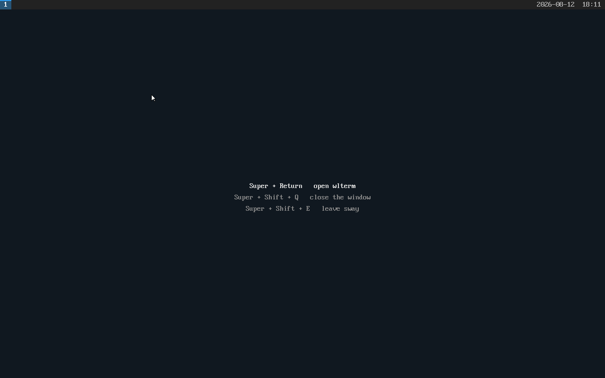
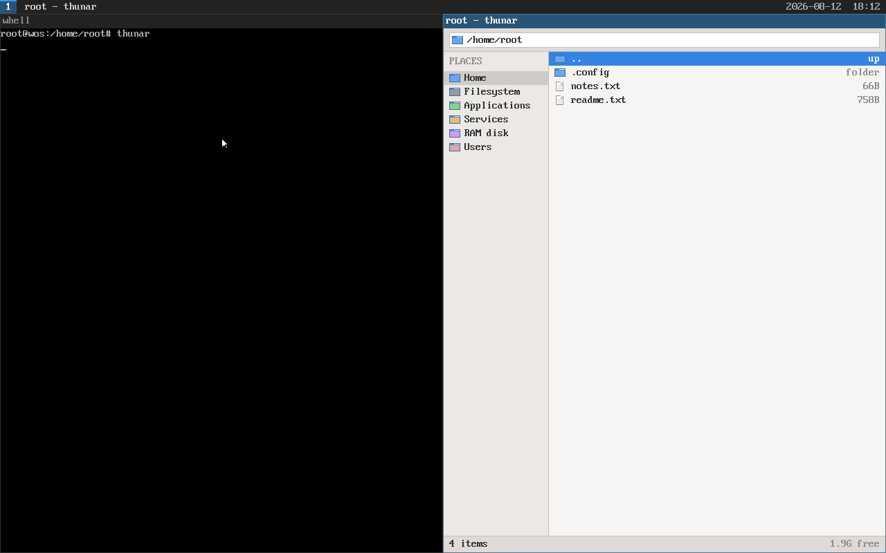
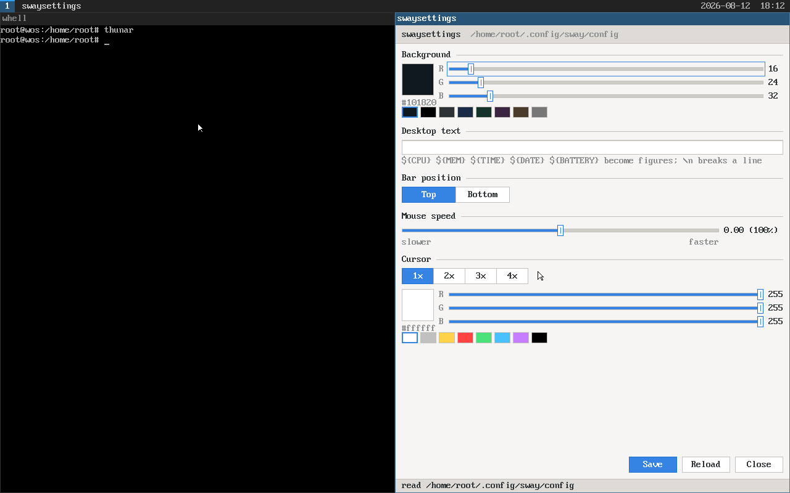
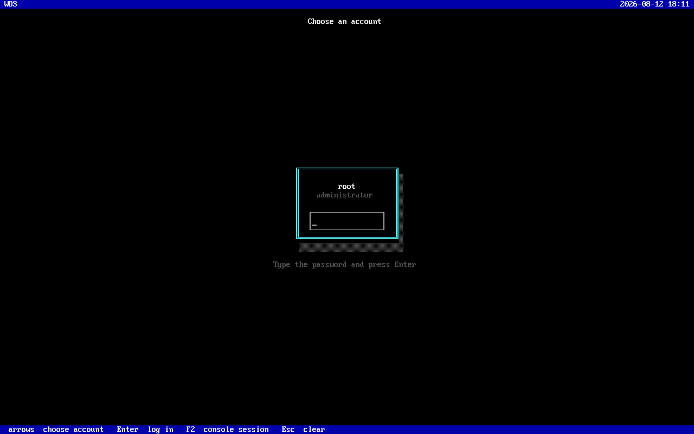
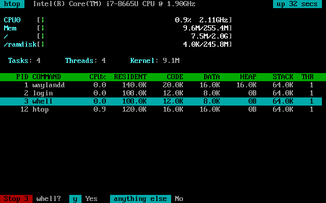
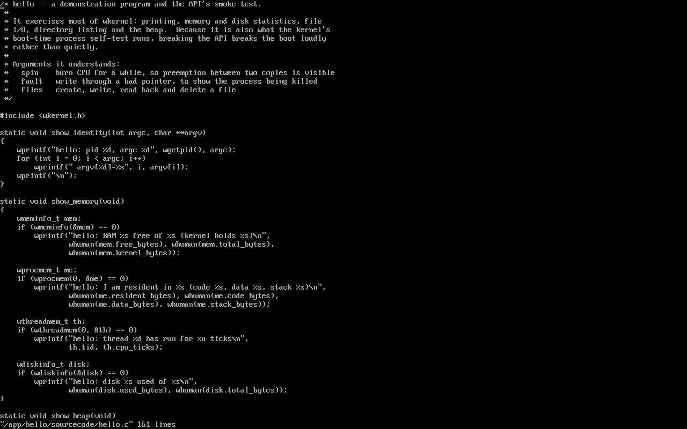
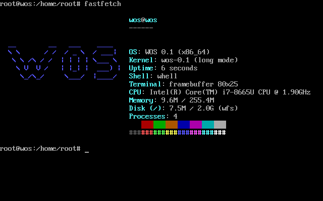
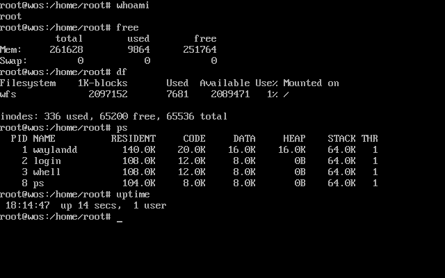
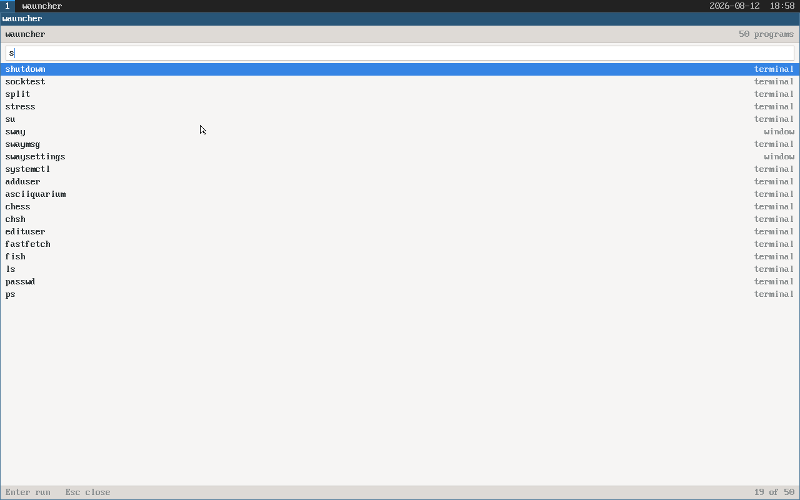
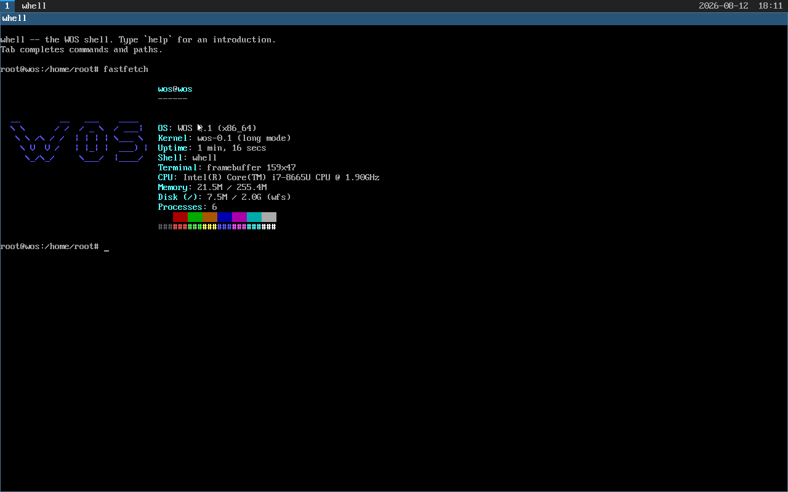

# WOS

A small operating system written from scratch in C, bootable under QEMU.

WOS is an x86-64 kernel that boots itself into long mode, with 4-level paging,
preemptive multitasking, ring-3 processes, a persistent filesystem on a real
disk, and a documented application API (`wkernel`). Its first application is a
shell called **whell**.

## Screenshots

Every picture below is a QEMU screendump of the image `make` builds, taken by
booting it and driving it from the outside — nothing here is a mock-up.

|  |  |
|:--|:--|
| **The desktop** — `sway`, tiling, drawn straight onto the framebuffer | **A terminal and a file manager** — `wlterm` and `thunar`, tiled by sway |
|  |  |
| **The settings window** — every value visible while it changes, written back to sway's own configuration file | **The login screen** — a box per account; Enter for a graphical session, F2 for a console |
|  |  |
| **`htop`** — a meter per core and per filesystem, and F9 to stop a process | **`vim`** — modal editing, search and hlsearch, on its own source |
|  |  |
| **`fastfetch`** — what the machine says about itself | **The console** — `whell`, and the commands that are programs in `/app` |
|  |  |
| **`wauncher`** — Super+Q, then type; `window` or `terminal` says how each one will start | **A terminal window** — `wlterm`, a Wayland client like any other |
|  |  |

More in [`docs/screenshots/`](docs/screenshots).

## Quick start

```sh
make          # build the kernel, the apps, the bootable ISO and the disk image
make run      # boot it in QEMU (VGA window, serial log on stdio; QEMU_CPUS=4)
make log      # boot headless for a few seconds and dump the serial log
make check    # boot it and check that it works: eleven scenarios, ~4 minutes
make clean

sudo tools/flash-usb.sh   # put it on a USB stick and boot it on real hardware
```

It boots to a login screen. The only account on a fresh image is `root` and its
password is **`1234`** — a known default, so change it with `passwd` on any
machine other people can reach. Enter starts the desktop; F2 gives a console.

Requirements: `gcc`, `binutils`, `grub-mkrescue` with the `i386-pc` platform
modules, `xorriso`, `mtools` and `qemu-system-x86_64`; `dosfstools` to write a
USB stick.
**No cross-compiler and no nasm are needed** — the host `gcc -m64` builds the
freestanding kernel and GAS assembles the `.S` files.

The CPU must support long mode. One that does not gets a legible message rather
than a triple fault; see [`docs/architecture.md`](docs/architecture.md).

## Layout

| Path | Contents |
|---|---|
| `kernel/` | the kernel: boot, arch (GDT/IDT/PIC/PIT), drivers, memory, filesystem, processes |
| `lib/wkernel/` | the application API — `wkernel.h` plus the library applications link against |
| `app/<name>/sourcecode/` | source for each application; the build installs its binary to `/app/<name>/launch` on the disk |
| `uefi/` | the UEFI loader — a PE32+ application with the kernel embedded, for firmware GRUB cannot hand over on |
| `tools/` | host-side tools, notably `mkwfs` which builds the disk image |
| `docs/` | API and shell documentation |

## On-disk layout

Every application owns a directory under `/app`:

```
/app/whell/launch            the executable
/app/whell/sourcecode/*.c    its source
```

A bare command name in `whell` resolves to `/app/<name>/launch` — that rule
*is* the search path, so there is no `PATH` variable to maintain.

## What it does

```
wos:/home$ ls
boots.txt   notes.txt   readme.txt
wos:/home$ free -h
          total        used        free
Mem:     255.8M        5.2M      250.6M
Swap:        0B          0B          0B
wos:/home$ hello
hello: pid 7, argc 1 argv[0]=hello
hello: RAM 250.5M free of 255.8M (kernel holds 5.1M)
hello: I am resident in 88.0K (code 8.0K, data 8.0K, stack 64.0K)
```

- An x86-64 kernel: a 32-bit Multiboot stub checks CPUID for long mode and
  jumps into 64-bit, then four-level paging with a per-process address space, a
  preemptive round-robin scheduler, ring-3 processes loaded from ELF64
  binaries, and `int 0x80` syscalls with every user pointer validated.
- **Every processor**: the machine's cores are started at the end of the boot
  with an interrupt and a page of real-mode code that repeats the long mode
  entry, each getting a local APIC timer, a TSS and an idle thread of its own.
  Threads are scheduled onto all of them from one run queue, behind a single
  kernel lock — so user code runs genuinely in parallel while kernel code stays
  serialised. Four `stress` workers peg four cores. See
  [`docs/architecture.md`](docs/architecture.md).
- **USB mass storage**: an xHCI driver and the bulk-only transport, so a machine
  that boots from a USB stick reads and writes that stick directly. See
  [`docs/usb.md`](docs/usb.md).
- **`/ramdisk`**, a filesystem held in memory that grows and shrinks with what
  is in it, over a disk that holds everything else.
- **WFS**, a filesystem on a real disk image — reads and writes persist across
  reboots, and the disk figures come from its block bitmap.
- **wkernel**, the documented application API: file and directory I/O, memory
  and disk statistics, process control, `printf`, `malloc`.
- **whell**, a shell with tab completion and line editing. It is deliberately
  tiny: only `cd`, `exit` and `help` are builtins, because only those change
  state belonging to the shell process.
- **Commands as programs**: `ls`, `pwd`, `cat`, `free`, `df`, `ps`, `touch`,
  `mkdir`, `mv`, `rm`, `clear`, `shutdown` and `reboot` each live in `/app`,
  behaving as
  they do on Linux. Both shells run the same ones.
- **The hardware, honestly**: `cpufreq` reads the processor's clock and holds
  it at a speed; `battery` says what the firmware knows about the pack,
  charge included. Both report what the machine will not tell them as unknown,
  rather than as a number nobody measured.
- **An AML interpreter**: the firmware describes the machine in a bytecode, and
  some of that description is a program rather than data. The kernel builds a
  namespace from the DSDT and the SSDTs and *runs* methods against it —
  arithmetic, control flow, and fields cut out of operation regions in memory,
  in I/O space and in the embedded controller. That is what the battery's
  charge comes back from: `_BST`, called rather than guessed at. See
  [`docs/architecture.md`](docs/architecture.md).
- **Services**: programs the machine runs rather than a person does, described
  by unit files in `/services` and managed with `systemctl` — list, start,
  stop, enable, disable.
- **A login screen**: the machine boots to `login`, a full-screen picker with a
  box per account and a password field in each. A correct password starts a
  graphical session **as that user** — which needs a seat handed over by root
  at the moment of login, since one screen and one keyboard cannot be a role.
  F2 gives a text session instead. Root's password on a fresh image is `1234`;
  see [`docs/users.md`](docs/users.md).
- **A graphical session**: `sway`, a tiling Wayland compositor, with `wlterm`
  as a terminal emulator in it, `thunar` as a file manager, `wauncher` on
  Super+Q to start anything by typing part of its name, `swaysettings` to
  change the background and what is written on it, the bar, the mouse speed and
  the cursor's size and colour with the values visible as they change, and
  `swaymsg` to drive it. Logging in starts it, and
  Super+Return opens a window; Super+Shift+E gives the console back with
  everything printed behind it still there. There is a **mouse**: a PS/2
  driver in the kernel, a cursor drawn by the compositor, click to focus,
  clickable workspaces on the bar, and `wl_pointer` delivered to clients —
  thunar selects on a click and opens on a double one. Windows tile in i3's
  tree, the bar sits at the top with the battery and the clock on it,
  configuration is read from `~/.config/sway/config` in sway's own language,
  and the IPC socket is i3's, so anything that speaks it speaks to this.
- **Wayland, for real**: a libwayland-shaped protocol library in both halves,
  with the interfaces transcribed from `wayland.xml` and `xdg-shell.xml`.
  Clients are written the way Wayland clients are written —
  `wl_display_connect()`, `wl_registry_add_listener()`,
  `wl_display_roundtrip()` — over local sockets that carry file descriptors and
  shared memory that lets a window's pixels reach the compositor without being
  copied.
- **Users and roles**: every process runs as a user, `root` may do anything,
  and everyone else writes only in their own `/home` directory unless a role
  says otherwise — `appeditor` for `/app`, `usereditor` for `/userconfig`,
  `editfreq` for the processor's clock, `systemctleditor` for the services.
  `/kernel` is root-only. Passwords live in `/userconfig/<name>/password`,
  readable and writable by root and the kernel alone, so `passwd` and `su`
  need no setuid.
- **Applications**: `fish` (a shell that colours commands as you type and
  suggests from history), `vim` (a modal editor with search and hlsearch),
  `fm` (a file manager for the console) and `thunar` (a graphical one, in a
  window under sway), `htop` (a live process monitor, with a meter per core
  and per filesystem, and the processor time each process is using),
  `stress` (load the machine on purpose) and `fastfetch`
  (system information). These are WOS-native programs
  in the spirit of the originals — see [`docs/apps.md`](docs/apps.md) for what
  the upstream versions would need that WOS does not have.

## Documentation

- [`docs/wkernel-api.md`](docs/wkernel-api.md) — every application-facing function,
  with parameters, return values, errors and examples
- [`docs/whell.md`](docs/whell.md) — the shell and its builtins
- [`docs/users.md`](docs/users.md) — users, roles, passwords and who may write where
- [`docs/apps.md`](docs/apps.md) — the commands (`ls`, `free`, `rm`, ...),
  fish, vim, htop, fastfetch, and the desktop: sway, wlterm, swaymsg
- [`docs/console.md`](docs/console.md) — raw input mode and the ANSI escape
  sequences full-screen programs use
- [`docs/architecture.md`](docs/architecture.md) — how the kernel fits together
- [`docs/usb.md`](docs/usb.md) — putting WOS on a USB stick and booting it on
  real hardware
- [`docs/building.md`](docs/building.md) — building, running, debugging, and
  adding an application
- [`docs/self-hosting.md`](docs/self-hosting.md) — the plan for compiling WOS
  on WOS: a C compiler, a `make`, and what has to exist under them first

## Testing

The kernel runs self-tests on every boot — frame accounting, heap
split/coalesce, address-space teardown, filesystem read/write/delete, and
spawning ring-3 processes — because an OS has no test runner to fall back on.
`/home/boots.txt` counts boots, which is the standing proof that writes reach
the disk. `make SELFTEST=0` builds without them, for a boot that goes straight
to the shell.

Interactive behaviour is tested with `tools/keytest.sh`, which types into QEMU
through the monitor:

```sh
./tools/keytest.sh 'pwd' 'ls -l' 'free -h'
```

## Status

Built in eighteen stages, each on its own branch and merged into `master` only
once it booted and passed its checks. See `git log --graph` and the `stage*`
tags — `stage1-boot-console` is a kernel that prints one line, `stage18-settings`
is the machine in the screenshots above.
